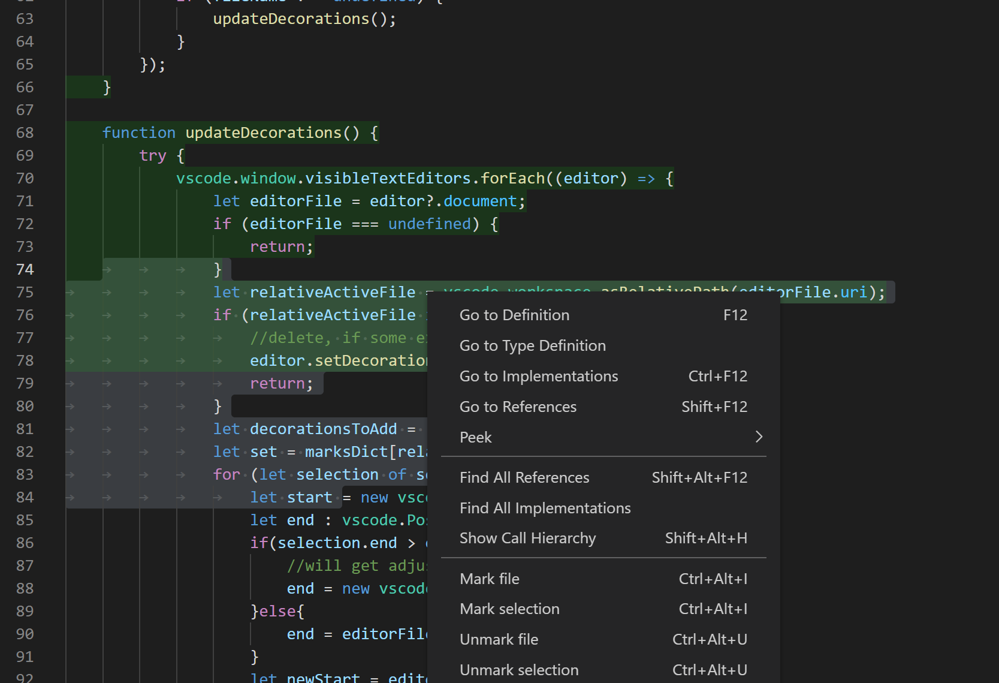

# AuditMark README

AuditMark is an Visual Studio Code extension, that lets you mark/unmark files and selections. This helps keeping an overview over the project.

## Features

There are 5 different commands:
* Mark selection
* Unmark selection
* Mark file
* Unmark file
* Unmark workspace

The first four are accessible via the right click menu.

Unmark workspace is only accesible via `Ctrl + Shift + P`.

## Keybindings

* `Ctrl + Alt + U`: If there is a selection, the selection gets unmarked. Otherwise the file gets unmarked
 * `Ctrl + Alt + I`: If there is a selection, the selection gets marked. Otherwise the file gets marked